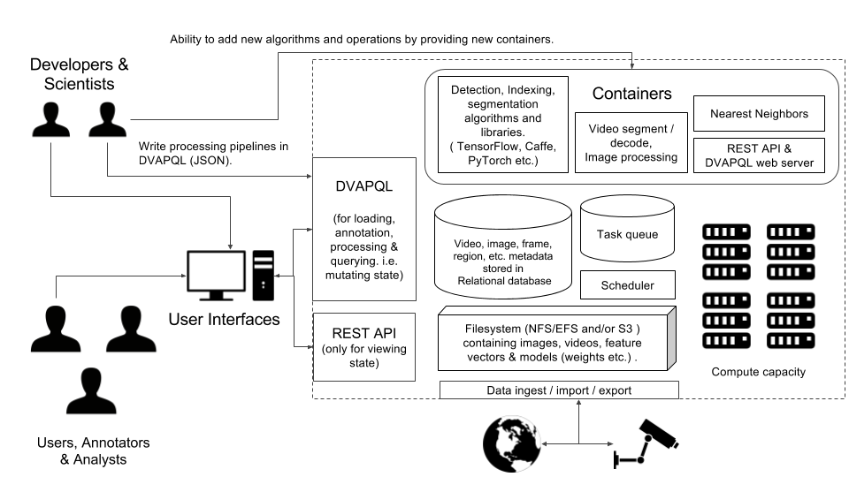

# Towards large scale intelligent systems that learn continuously and interactively in a reproducible manner

### Current state of AI/ML libraries & frameworks
Over the last five years with emergence of deep learning, several libraries and frameworks such as Caffe, Torch, 
PyTorch, Tensor Flow have been developed for training models. Each new library has solved news problems such as model portability,
distributed training, autograd, etc. For an overview of evolution of Deep Learning Libraries listen 
to this [podcast by Soumith (one of the creators of PyTorch)](https://www.oreilly.com/ideas/why-ai-and-machine-learning-researchers-are-beginning-to-embrace-pytorch).

### Towards a data-centric approach
Most of the published research in Computer Vision uses a model-centric pattern illustrated above. 
Typically researchers download existing dataset or collect & annotate new data. Either a baseline model or
 a new model is proposed and evaluated for solving a particular problem (detection, segmentation, counting etc.)
 As a result libraries such as PyTorch, Caffe and TensorFlow, only specify model and training/inference process. 
 A significant part Computer Vision research and applications involves data collection, annotation and organization. Currently there 
 are no frameworks that support these tasks. The closest would be something like Robot Operating System (ROS) used in robotics.  
 While the pattern described above works well for specific tasks, it slows down research in Computer Vision, 
 especially in topics such as interactive learning or learning by continuously ingesting data. We believe that by adopting a
 data-centric system we can enable novel research as well as applications that are even difficult to imagine in the current
 model-centric paradigm. 
 

 We present Deep Video Analytics a data-centric platform for analysis of Visual Data. Deep Video Analytics, 
 imposes structure on not only models and data but also on the processing pipeline. Deep Video Analytics can
 be thought of being similar to a traditional relational database. In fact most of the metadata about videos, datasets,
 models, frames, regions etc. is stored in relational database. 

### Three essential components: Language, Data model & Implementation

To build a distributed visual data processing system we provide three components which we believe are essential to build the system
in an extensible manner.

- **Data & Processing model**: We provide schema for representing videos, frames, regions, tubes, models and events.
- **Language**: Similar to SQL we introduce DVAPQL an event based language for ingesting, processing and 
  querying (via visual search) visual data.
- **Implementation**: We provide a function implementation of the above two that scales to multiple machines and includes a
  user interface & APIs.

We hope that by working with vision research community we can iterate on data model and language, while improving the implementation.

### Architecture for distributed intelligence

  
### Practical scaling with containers, spot/preemptible and lambda

 
 
With advent of cloud computing, its now possible to launch thousands of short lived tasks to
10~100s of instances with GPUs. Building systems capable of leveraging this type of computing power
 is not trivial, further until now such systems required significant amount of DevOPs / Systems Administration.
 However with advent of containers which abstract away all OS level components such as libraries, drivers etc. and
 container orchestration systems such as Kubernetes (supported by Google Container Engines) and AWS Elastic Container 
 Service. It is now possible to deterministically specify all components. 
 
 ### Learning continuously/interactively while maintaining reproducibility

Several researcher have proposed systems that learn continuously by surfing web or through user feedback.
However these studies typically do not share code used for building the system, even if the code is shared 
its not easily extensible.  

 

### From annual competitions to near-realtime collaboration 

Today yearly competitions such as COCO, ILSVRC are the gold standard for establishing state of the art.
 